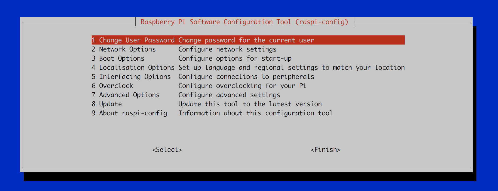
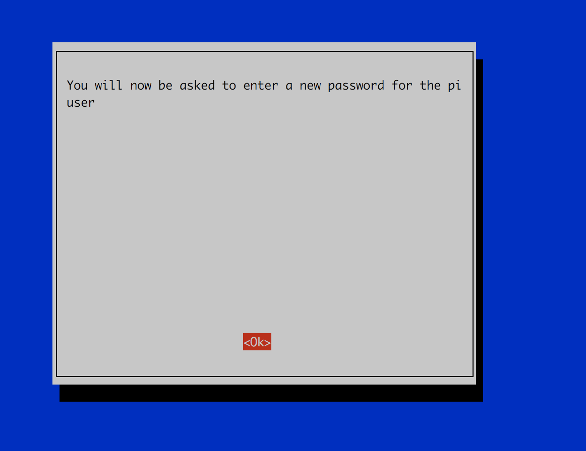
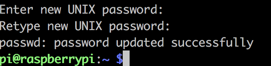
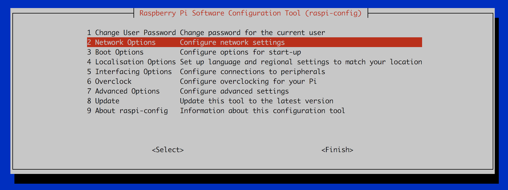
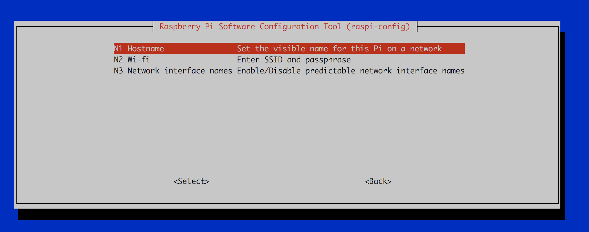
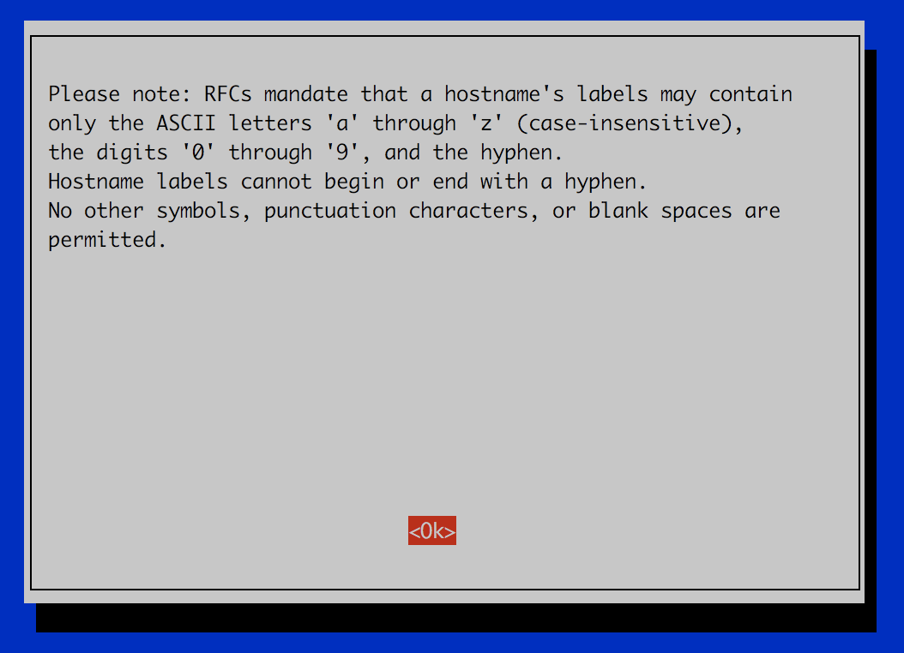
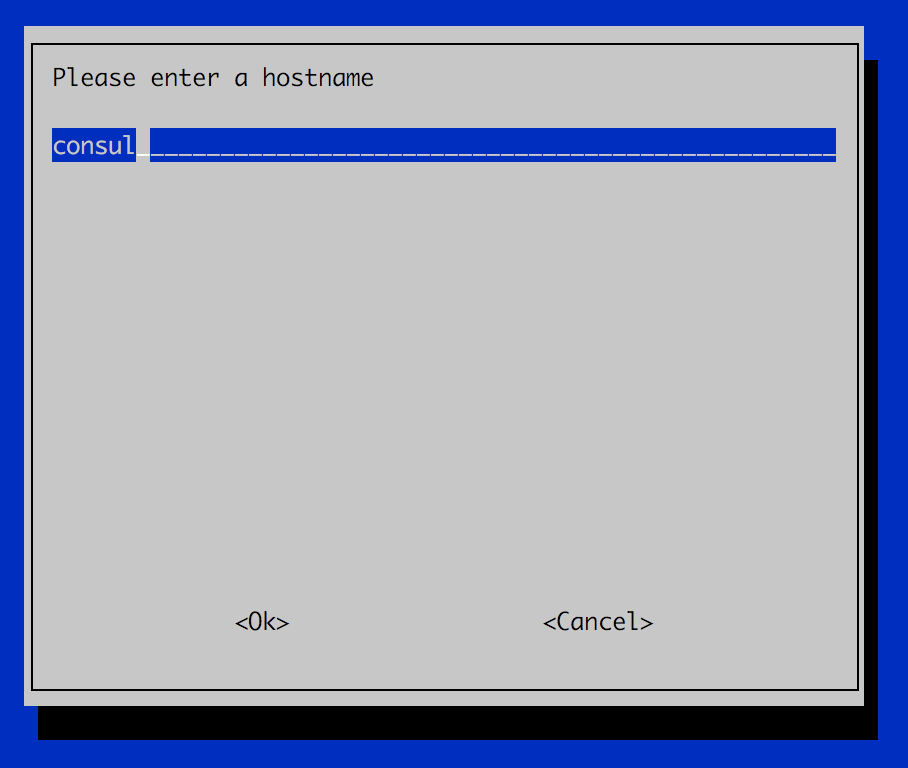

# Basic Security Practices for Public Exhibition

## Change the `pi` password and hostname

By default, *every raspberry pi on the planet* has the same login credentials of username `pi`, password `raspberry`, on a device called `raspberrypi`

This makes is very easy for people to get started, but is a security nightmare, especially if you ever hope to leave the building you have set your Pi up in without random anxiety attacks.

We can change both the primary user (`pi`) password, and the device hostname, from the included configuration panel from the terminal we used earlier

```bash
sudo raspi-config
```





First off, selecting option `1 Change User Password` gives us an informative window, and then drops back to the console for you to add your own password.






Once this operation is complete you'll be put back to the `raspi-config` menu.

Now, to change the hostname from `raspberrypi` to something more personal, we select option `2 Network Options` and then `N1 Hostname`





This lovely warning screen simply means that you can only use letters, numbers, and hyphens in hostnames, and that hostnames cannot start or end with a hyphen.

_Personally, hypens in hostnames are a bad idea and I'd avoid them unless you really really want to_





**For this change to take effect, you must reboot your Pi**

```bash
sudo reboot
```


